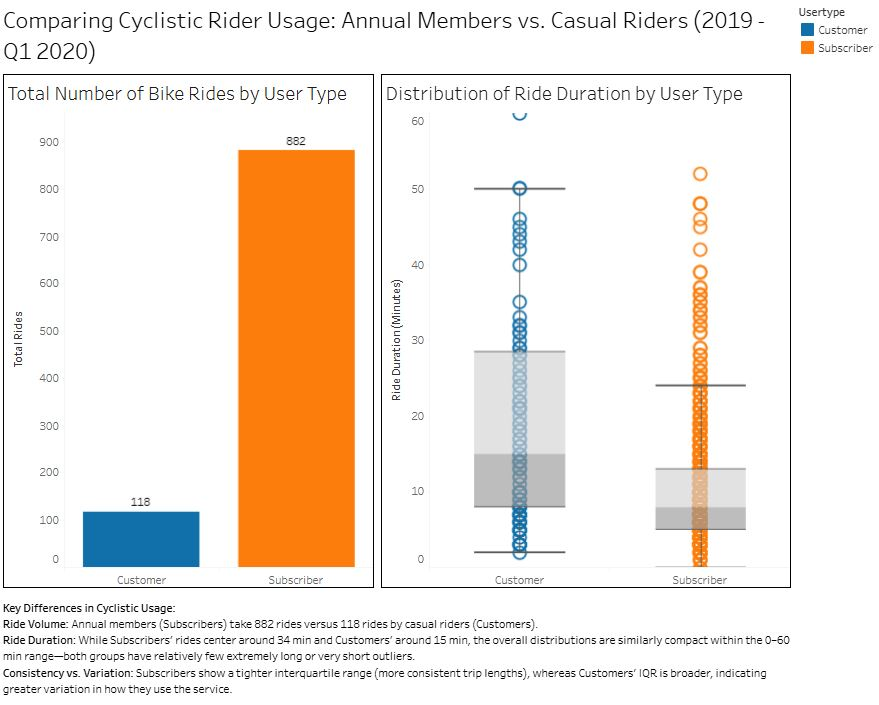
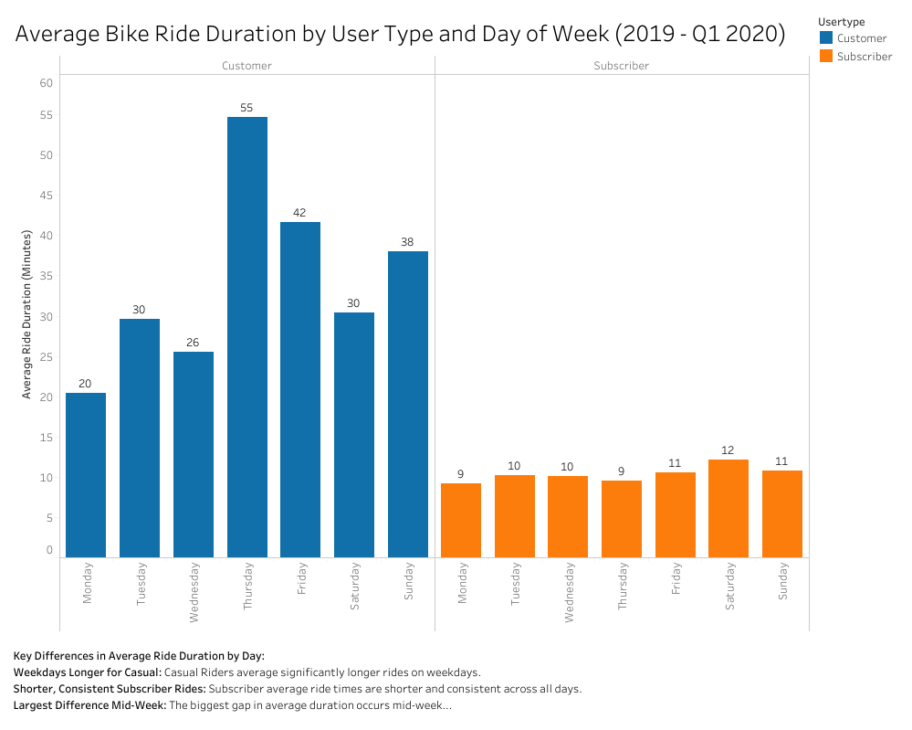
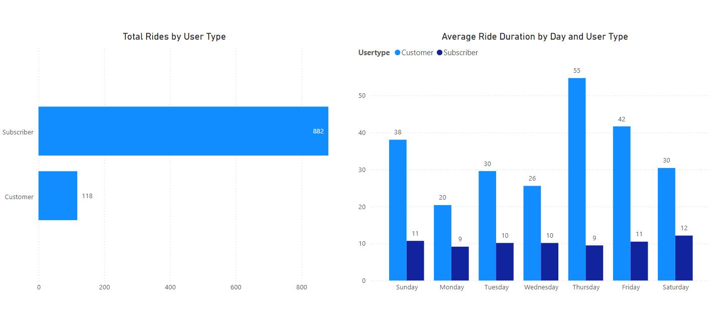

# cyclistic-bike-share-analysis
# Data analysis of Cyclistic bike-share data to identify user differences and drive casual rider conversion

## 1. Project Overview

This project involves a comprehensive data analysis of Cyclistic's bike-share program to understand the distinct behaviors of annual members and casual riders. The primary objective was to identify key differences between these user segments and leverage these insights to develop data-driven marketing strategies aimed at converting casual riders into annual members, thereby maximizing profitability.

## 2. Business Task

The main business task was to analyze historical bike trip data to:
* Identify how casual riders and annual members use Cyclistic bikes differently.
* Based on these differences, propose strategic recommendations to convert casual riders into annual members.

## 3. Data Source

The dataset used for this analysis is Cyclistic's historical bike trip data. This public dataset, provided by Motivate International Inc. (the company behind Divvy Bikes, which operates Cyclistic's bike-share program), is licensed under the **[Google Cloud Public Datasets Terms of Use](https://cloud.google.com/terms/service-terms/maps-platform)**.

* **Source:** Divvy Tripdata (available via Google Cloud Public Datasets) - [Link to BigQuery Public Dataset Interface for Divvy](https://console.cloud.google.com/marketplace/details/city-of-chicago/divvy-bikeshare)
* **Raw Data Bucket (for reference):** `gs://divvy-tripdata/`
* **Time Period:** Q1 2019 to Q1 2020 (12 months of data)

## 4. Tools Used

* **SQL (Google BigQuery):** For efficient data cleaning, transformation, and aggregation of large datasets.
* **R:** For exploratory data analysis, statistical summaries, and further data manipulation.
* **Tableau Public:** For creating interactive dashboards and compelling visualizations to present key findings.
* **Power BI:** For building interactive dashboards and advanced business intelligence reports.
* **PowerPoint:** For creating the final presentation deck.

## 5. Methodology & Key Steps

The analysis followed a structured data analysis process, leveraging different tools for each stage:

* **1. Data Collection & Loading:**
    * **Purpose:** Accessed raw trip data from Google Cloud Public Datasets (Divvy tripdata bucket).
    * **Process:** Utilized Google BigQuery for efficient loading and initial querying of the large datasets.

* **2. Data Cleaning & Transformation (SQL):**
    * **Purpose:** To prepare the raw, messy quarterly datasets into a clean, unified, and consistent format suitable for analysis.
    * **Process:**
        * Handled schema inconsistencies by renaming and casting messy column names (e.g., from Q2/Q4 2019) to match standardized naming conventions.
        * Addressed missing fields (e.g., in Q1 2020) by padding with `NULL`s to ensure dataset union compatibility.
        * Combined all quarterly datasets into a single, comprehensive view using `UNION ALL`.
        * Standardized data types, specifically casting `trip_id` to `STRING`.
        * **Feature Engineering:** Derived critical new metrics such as `ride_length_min` (trip duration in minutes) and `day_of_week` from existing `start_time` and `end_time` timestamps, which were vital for understanding usage patterns.
    * *See `sql/data_cleaning_queries.sql` for the detailed SQL script.*

* **3. Exploratory Data Analysis & Further Processing (R):**
    * **Purpose:** To conduct in-depth statistical analysis, generate key metrics, and prepare aggregated data for visualization, building upon the SQL-cleaned dataset.
    * **Process:**
        * Loaded the cleaned and transformed data (likely exported from BigQuery as a CSV) into an R environment.
        * Performed data type conversions and re-derived `ride_length_min` and `day_of_week` within R for consistency and further manipulation.
        * Filtered out invalid ride data (e.g., zero or excessively long durations).
        * Generated summary statistics (total rides, average, median, min/max duration) grouped by user type.
        * Calculated ride counts by user type and day of the week.
        * Developed preliminary visualizations (e.g., average ride length bar chart, ride duration boxplot) to explore initial insights.
        * Exported aggregated summary data (e.g., `summary_stats.csv`, `rides_by_day.csv`) for potential use in other tools or for record-keeping.
    * *See `r_analysis/cyclistic_full_analysis.R` for the R analysis script.*

* **4. Data Visualization (Tableau & Power BI):**
    * **Purpose:** To create compelling and interactive dashboards that visually represent the key findings from the analysis, making complex data insights easily understandable.
    * **Process:** Designed and built dashboards to compare user behavior patterns (e.g., ride volume, average duration, temporal trends) between casual riders and annual members using both Tableau and Power BI.
    * *See `visuals/` folder for dashboard screenshots and links to live Tableau Public dashboards below. Power BI files and screenshots are in the `PowerBI_Dashboard/` folder.*

* **5. Recommendation Development:**
    * **Purpose:** To translate data-driven insights into actionable business strategies.
    * **Process:** Formulated specific marketing and retention recommendations aimed at converting casual riders into annual members, directly addressing the initial business task.

* **6. Presentation:**
    * **Purpose:** To effectively communicate the entire analytical journey, key findings, and recommendations to stakeholders.
    * **Process:** Compiled a comprehensive presentation deck summarizing the methodology, insights, and proposed solutions.
    * *See `presentation/cyclistic_case_study_report.pdf` for the complete slide deck.*

## 6. Key Findings

Based on the analysis, significant differences were identified between casual riders and annual members:

* **Volume Disparity:** Subscribers accounted for 88% of total rides (882 vs. 118 casual rides) over our study period.
* **Average Trip Duration:** Subscribers ride 3x longer on average—34 min vs. 10 min for Casual Riders.
* **Duration Consistency:** Subscriber trip lengths cluster tightly around 25–45 min; Casual Rider durations are far more dispersed, up to the 60 min free-ride limit.
* **Peak Usage Days:** Both groups ride most on Saturdays and Sundays, but Casual Riders show larger weekend spikes.

## 7. Visualizations

Explore the interactive dashboards on Tableau Public and static images here. Both dashboards are part of the same Tableau Public workbook.

### **Dashboard 1: Comparing Cyclistic Rider Usage**
This dashboard provides an overview of ride volume distribution between annual members and casual riders.

### **Dashboard 2: Average Ride Duration Patterns by Day and User Type**
This visualization illustrates the average ride duration patterns across different days of the week for both casual and annual users.

### **View Live Dashboards on Tableau Public**
[Cyclistic Rider Analysis Dashboards](https://public.tableau.com/app/profile/david.martinez6844/viz/CyclisticRiderAnalysis_17472629388140/Dashboard1)

### **Dashboard 3: Cyclistic Rider Analysis in Power BI**
This dashboard presents key insights into rider behavior using Power BI, including total rides by user type and average ride duration patterns.

You can find the Power BI Desktop file (`.pbix`) here: [Cyclistic_Rider_Analysis_Dashboard.pbix](PowerBI_Dashboard/Cyclistic_Rider_Analysis_Dashboard.pbix)

## 8. Recommendations for Conversion

Based on the distinct behaviors identified:

* **Tailored Marketing for Leisure-Oriented Riders:** Develop campaigns emphasizing the benefits of membership for longer, recreational rides and weekend usage.
* **Subscriber Value Reinforcement:** Emphasize unlimited rides, cost savings, and convenience to retain members and highlight superior value.
* **Incentivize Frequent Casual Users:** Identify casual riders with high ride frequency and offer targeted discounts or promotions to nudge them towards membership.

## 9. Next Steps / Future Work

This analysis primarily addressed how casual and annual riders differ. For future work, it would be beneficial to investigate the remaining guiding questions from the case study:

* **Understanding Motivations:** Delve deeper into "Why casual riders would buy a membership" to uncover their specific needs and pain points.
* **Digital Media Strategy:** Explore "How digital media could influence casual riders to become members" to identify effective channels and content.

## 10. Contact

Feel free to reach out with any questions or collaboration opportunities!

* **Your Name:** David Martinez
* **Email:** [demartinez722@gmail.com](mailto:demartinez722@gmail.com)
* **LinkedIn:** [David Martinez](https://www.linkedin.com/in/davidmartinezanalyst)
